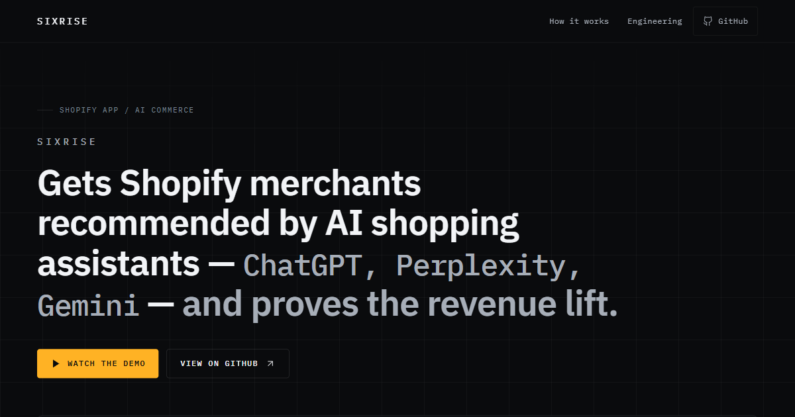

<h1 align="center">sixrise.app</h1>

<p align="center">
  The public landing page for <b><a href="https://sixrise.app">SixRise</a></b> — a Shopify embedded app that gets merchants recommended by AI shopping assistants.
</p>

<p align="center">
  <a href="https://sixrise.app"></a>
  
  
  
  
</p>

<p align="center">
  
</p>

---

## Why this repo exists

Every real route in SixRise sits behind `authenticate.admin` and only renders inside the
Shopify admin iframe after OAuth — **there is no URL a visitor can click to see the product.**
This page is the substitute: a demo video, the architecture story, and a link to the source.

It is a **static single page** with a deliberate constraint — no backend, no API routes, no
database, no auth, no environment variables. `npm install → npm run build → deploy`. The
interesting engineering here is what got *left out* and why.

## What's notable

- **Zero third-party requests.** Fonts (IBM Plex Sans / Mono) are bundled from `@fontsource`,
  not fetched from a CDN — no font-swap reflow, no external dependency at runtime.
- **Accessibility was measured, not assumed.** Every distinct foreground/background/size
  combination was checked against WCAG AA in the browser. `--color-ink-3` was lightened from
  `#6b7280` to `#7a8593` because it measured 4.07:1 on the canvas — under the 4.5:1 floor —
  and it carries most of the page's small mono text.
- **The measurement copy inherits the product's own invariants.** A missing rate is `null`
  and renders as *"no data this period"* — never `0%`, never a fabricated decline (there is no
  `?? 0` in the read path). The hero figure stays `pending` until a real settled measurement
  exists; **the pending state is designed, not broken.** Copy is observational
  ("before X, after Y"), never "uplift caused by" — the measurement is shop-level and can't be
  attributed to a single fix.
- **No chart or diagram libraries.** The how-it-works loop is hand-authored inline SVG
  (`src/components/LoopDiagram.tsx`); the before/after mark is a dumbbell drawn with layout
  primitives, its axis pinned to zero so the segment length can't overstate the movement. Both
  degrade to real text below 768px, so neither is the sole carrier of its information.
- **`prefers-reduced-motion: reduce`** suppresses every transition and smooth scroll.

## Stack

**Vite · React 19 · TypeScript · Tailwind CSS v4.** No runtime dependencies beyond React;
static output into `dist/`.

---

## Editing the content

**Everything editable lives in [`src/content.ts`](src/content.ts)** — no copy, link, or number
is written anywhere else. It's typed against the `SiteContent` interface in the same file, so a
half-finished edit fails `npm run typecheck` instead of quietly shipping a blank spot.

Four blanks are marked `TODO`:

| # | Field | What to do |
|---|---|---|
| 1 | `demo` | Point it at the video (see below) |
| 2 | `metric` | Swap `status: "pending"` for the `status: "live"` shape once a settled figure exists — a filled example sits commented out directly above it |
| 3 | `footer.name` | Your full name, as you want it printed |
| 4 | `footer.linkedin` | Your LinkedIn profile URL |

Until 3 and 4 are filled, the footer renders a visible dashed placeholder rather than a broken link.

<details>
<summary><b>Dropping in the demo video</b></summary>

<br/>

Self-hosted (simplest — served same-origin, nothing third-party loads):

```ts
demo: { kind: "file", src: "/demo.mp4", poster: "/demo-poster.jpg" },
```

…with the file saved to `public/demo.mp4`. Keep it under ~50 MB, encode as H.264 MP4.

Hosted (both **click-to-load** — nothing is requested from YouTube/Loom until the visitor presses play):

```ts
demo: { kind: "youtube", id: "dQw4w9WgXcQ" },
demo: { kind: "loom",    id: "0123456789abcdef0123456789abcdef" },
```

All four variants reserve the identical 16:9 box, so switching never shifts the layout.

</details>

<details>
<summary><b>The hero metric — do not invent a number</b></summary>

<br/>

It stays `pending` until a real settled measurement exists. The pending state shows the
hero-figure slot, the axis, and both endpoints with every value struck out as unmeasured, and
explains the 168-hour settle window. Two rules (enforced in `src/components/MetricBand.tsx`)
carry over from the product's verifier:

- **A missing rate is `null` → "no data this period."** Never `0%`, never a decline.
  Coalescing here would show a fabricated regression for what was only a flaky engine.
- **Copy is observational** — never "uplift caused by." The measurement is shop-level.

</details>

<details>
<summary><b>The OG preview image</b></summary>

<br/>

`public/og.png` is a 1200×630 capture of the hero, used for link previews on LinkedIn, Slack,
and X. If the headline copy changes, regenerate it: `npm run preview`, open at a 1200×630
viewport, and screenshot the top of the page over the existing file.

</details>

---

## Local development

```bash
npm install
npm run dev        # http://localhost:5173
npm run typecheck  # tsc --noEmit
npm run build      # typecheck + production build into dist/
npm run preview    # serve the built output
```

---

## Deploying

<details>
<summary><b>Vercel</b></summary>

<br/>

1. Push this directory to its own GitHub repository.
2. Vercel → **Add New → Project** → import the repo.
3. The **Vite** preset is detected automatically: build `npm run build`, output `dist`, install
   `npm install`. **Environment variables: none.**
4. Deploy, and confirm the generated `*.vercel.app` URL renders correctly **before** touching any DNS.

</details>

<details>
<summary><b>Attaching the custom domain (sixrise.app)</b></summary>

<br/>

**1. Add the domain in Vercel** — Project → **Settings → Domains** → add `sixrise.app`, then
`www.sixrise.app`. Set one to redirect to the other; apex-primary (`www` → `sixrise.app`) is usual.

**2. Create the DNS records at the registrar** — Vercel shows a domain card per domain with the
exact records it expects.

| Host | Type | Value |
|---|---|---|
| `@` (apex) | `A` | the IP shown on the domain card |
| `www` | `CNAME` | the hostname shown on the domain card |

**Copy the values off the card, not out of any guide — including this one.** Verification checks
for the exact record Vercel issued for *your* project. Older projects show the anycast
`76.76.21.21` / `cname.vercel-dns.com`; newer ones get a project-specific IP (e.g.
`216.198.79.1`) and per-project CNAME target. An apex domain can't use a CNAME — that's why the
root is an `A` record.

**3. Certificates & CAA** — Vercel provisions TLS automatically once DNS resolves. Two silent
blockers: a restrictive `CAA` record that doesn't permit Let's Encrypt (no `CAA` record is
fine), and DNS not yet propagated (give it a few minutes).

**4. `.app` is HTTPS-only** — the TLD is on the HSTS preload list, so browsers refuse plain HTTP
outright; there is no http→https fallback. Never share an `http://sixrise.app` link. In the
window between DNS propagating and the certificate issuing, the domain looks broken rather than
insecure — that's expected; wait it out.

References: [A records and CAA on Vercel](https://vercel.com/kb/guide/a-record-and-caa-with-vercel)
· [Adding a custom domain](https://vercel.com/docs/domains/working-with-domains/add-a-domain)

</details>
